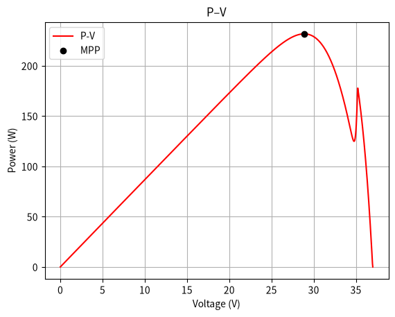
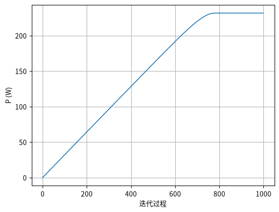
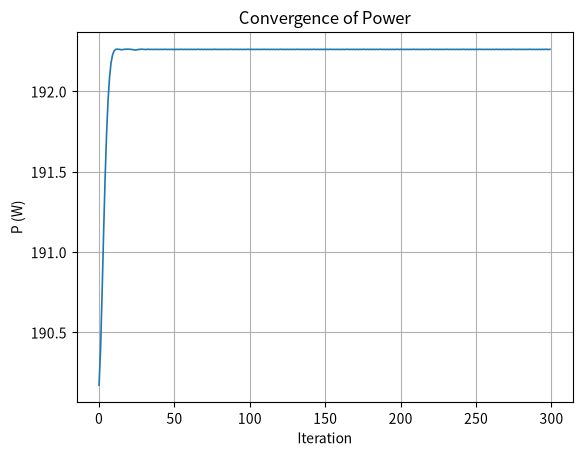
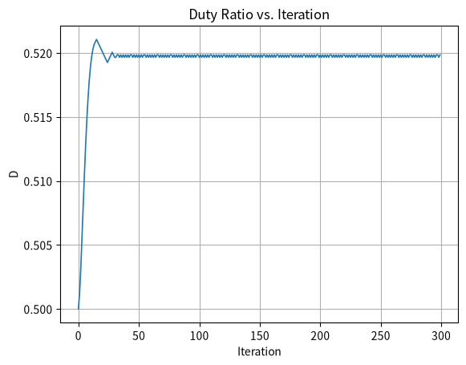
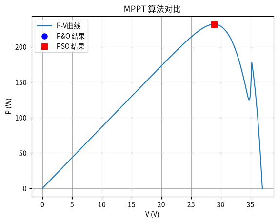

# 2.2 传统MPPT算法详解：扰动观察法（P&O）与电导增量法（INC）

## 2.2.1 扰动观察法（Perturb and Observe, P&O）

### 基本原理与工作机制

扰动观察法是最早被提出且应用最广泛的最大功率点跟踪算法之一。其核心思想基于一个简单的"试探-比较-决策"闭环逻辑：周期性地对光伏阵列的输出电压施加一个小的**扰动**，然后**观察**输出功率的变化方向，从而**决策**下一步的扰动方向。

**算法数学描述**：

- 在k时刻，测量电压V(k)和电流I(k)，计算功率P(k) = V(k) × I(k)
- 施加扰动后，在k+1时刻测量V(k+1)和I(k+1)，计算P(k+1)
- 比较ΔP = P(k+1) - P(k)和ΔV = V(k+1) - V(k)的关系：
  - 若ΔP > 0且ΔV > 0，工作点在MPP左侧，继续增加电压
  - 若ΔP > 0且ΔV < 0，工作点在MPP右侧，继续减小电压
  - 若ΔP < 0且ΔV > 0，工作点已越过MPP，需减小电压
  - 若ΔP < 0且ΔV < 0，工作点已越过MPP，需增加电压

工作点在 P-V 曲线上从左侧逐步逼近最大功率点的过程，可用本仓库 `代码/perturb_and_observe_basic.m`（Python 版：`python/perturb_and_observe_basic.py`）复现并绘制。下方的 P-V 曲线与功率收敛过程图即由其真实运行得到：

> **动手实验**：在 `python/` 目录执行 `uv run python perturb_and_observe_basic.py`，即可重现上图的 P-V 曲线、功率收敛曲线与电压变化过程（输出到 `python/figures/`）。

### 工作流程与实现步骤

P&O法的典型实现流程包括以下步骤：

1. **初始化**：设置初始工作电压（本仓库实现取开路电压的一半，即 `V = Voc/2`，见 `代码/PandO_algorithm.m`；实际工程也常取 70%-80% Voc 起步）
2. **参数采样**：采集当前光伏阵列的输出电压V(k)和电流I(k)
3. **功率计算**：计算当前功率P(k) = V(k) × I(k)
4. **施加扰动**：根据上一步决策方向，调整参考电压（增加或减少一个步长）
5. **比较判断**：计算功率变化ΔP和电压变化ΔV，根据上述规则判断下一步扰动方向
6. **循环执行**：重复步骤2-5，实现持续跟踪

*（流程图示意：P&O 判断逻辑即"扰动→测功率→比较方向→决定步长方向"，完整可运行实现见 `代码/PandO_algorithm.m` 与 `python/pando_algorithm.py`；其收敛过程见上文示意。）*

### 性能特点与分析

**优势**：

- **结构简单**：控制逻辑清晰，易于理解和实现
- **成本低廉**：仅需电压和电流传感器，无需检测环境参数
- **应用成熟**：是目前最常用、最成熟的MPPT方法之一

**固有缺陷**：

1. **稳态振荡**：在达到最大功率点后，算法无法稳定于一点，而是在其附近持续振荡，导致一定的功率损失。振荡幅度与扰动步长直接相关。
2. **快速变化环境下的误判**：当外界环境（如光照）快速变化时，算法可能错误判断变化方向。例如，光照突然增强导致的功率增加可能被误认为是扰动正确所致，从而向错误方向扰动。

变步长 P&O 正是针对"稳态振荡"的改进：`代码/mppt_adaptive_slope_boost.m`（Python 版 `python/mppt_adaptive_slope_boost.py`）用"基于斜率 dP/dV 的自适应步长"在接近 MPP 时自动缩小步长。下图是其真实功率收敛过程与占空比变化（G=800W/m²、T=35°C 下，MPPT 收敛到 V≈29.8V、P≈192W）：

### 改进策略

针对传统P&O法的缺陷，常见的改进方向包括：

- **变步长P&O法**：根据工作点与MPP的距离动态调整扰动步长，远离MPP时采用大步长提高跟踪速度，接近MPP时采用小步长减小振荡
- **自适应P&O法**：根据环境变化速率自适应调整扰动周期或步长

## 2.2.2 电导增量法（Incremental Conductance, INC）

### 数学原理与理论基础

电导增量法基于光伏电池P-V特性曲线在最大功率点处斜率为零（dP/dV = 0）这一严格的数学特性推导而来。

**核心数学推导**：
在最大功率点处，功率对电压的导数为零：
$\frac{dP}{dV} = 0$
将P = VI代入得：
$\frac{d(VI)}{dV} = I + V\frac{dI}{dV} = 0$
整理得MPP处的必要条件：
$\frac{dI}{dV} = -\frac{I}{V}$

由此可得工作点位置的判断准则：

- 当dI/dV > -I/V时，工作点在MPP左侧（dP/dV > 0）
- 当dI/dV < -I/V时，工作点在MPP右侧（dP/dV < 0）
- 当dI/dV = -I/V时，工作点位于MPP处（dP/dV = 0）

*（原理示意：P-V 曲线在 MPP 处斜率为零，即 dP/dV=0。`代码/INC_algorithm.m` 用简化线性模型演示该收敛过程，运行 `uv run python inc_algorithm.py` 可见 MPP≈Voc/2。）*

> **代码对应**：本仓库 `代码/INC_algorithm.m`（Python 版 `python/inc_algorithm.py`）用简化线性模型清晰演示"dP/dV=0 收敛"的核心思想——经典结论下最大功率点恰在 Voc/2 处。运行 `uv run python inc_algorithm.py` 可验证：36V/5A 组件得到 MPP ≈ 18V。

### 算法实现流程

INC法的具体实现步骤如下：

1. **参数采样**：测量当前光伏阵列的输出电压V(k)和电流I(k)
2. **增量计算**：计算电流增量ΔI = I(k) - I(k-1)和电压增量ΔV = V(k) - V(k-1)
3. **电导比较**：计算瞬时电导I/V和增量电导ΔI/ΔV
4. **位置判断**：
   - 若ΔI/ΔV > -I/V，工作点在MPP左侧，需增大电压
   - 若ΔI/ΔV < -I/V，工作点在MPP右侧，需减小电压
   - 若ΔI/ΔV ≈ -I/V，工作点位于MPP，保持电压不变
5. **控制输出**：根据判断结果调整DC-DC变换器的占空比
6. **循环执行**：重复上述过程实现持续跟踪

*（流程图示意：INC 判断分支即上文"位置判断"四步，完整可运行实现见 `代码/INC_algorithm.m` 与 `python/inc_algorithm.py`。）*

### 性能特点与分析

**优势**：

- **理论精度高**：基于严格的数学推导，跟踪精度理论上优于P&O法
- **环境变化响应好**：能够更好地区分功率变化是由扰动还是环境变化引起，在光照快速变化条件下性能优于P&O法
- **稳态振荡小**：在判断达到MPP后可保持电压不变，显著减小稳态功率损失

**局限性**：

- **计算复杂度高**：需要进行微分运算，对处理器的计算能力要求较高
- **实现成本稍高**：需要更精确的传感器和更快的采样速度
- **参数敏感性**：算法性能受步长等参数设置影响

*（动态对比示意：本仓库在统一模型下对 P&O/PSO 的静态对比见 2.2.4 节；光照突变下的动态响应需在 Simulink 中搭建，见 5.1/5.2 节。）*

## 2.2.3 两种算法的对比与选型指南

### 性能对比总结

| **对比维度** | **扰动观察法(P&O)** | **电导增量法(INC)** |
|------------|-------------------|-------------------|
| **核心原理** | 基于功率变化方向的启发式试探 | 基于dP/dV=0的数学推导 |
| **跟踪精度** | 中等，存在稳态振荡 | 高，稳态振荡小 |
| **动态响应** | 环境快速变化时易误判 | 对环境变化不敏感，响应更准确 |
| **计算复杂度** | 低，实现简单 | 高，需微分运算 |
| **硬件要求** | 普通微处理器即可 | 需要较强的计算能力 |
| **成本因素** | 低 | 相对较高 |

### 应用场景选择建议

**选择P&O法的场景**：

- 环境变化相对缓慢的中小型光伏系统
- 对成本敏感的应用场合
- 初学者学习和基础实验验证

**选择INC法的场景**：

- 环境变化较快、对效率要求较高的系统
- 具备较强处理能力的控制器平台
- 追求较高能量捕获效率的商业光伏电站

### 仿真实现要点

在MATLAB/Simulink中实现两种算法时应注意：

**P&O法关键参数**：

- 扰动步长：影响跟踪速度和稳态精度间的权衡
- 采样周期：应与系统动态响应特性匹配

**INC法关键参数**：

- 微分计算方法的选取（如差分近似）
- 判断条件的容差设置，避免频繁切换

*（Simulink 中的关键模块配置见 5.1/5.2 节；MATLAB/Octave 与 Python 下的数值对比见 2.2.4 节真实实验。）*

## 2.2.4 两种算法对比的真实实验

在统一单二极管模型（`代码/pv_params.m` + `代码/pv_current.m`）下，本仓库的 `代码/mppt_algorithm_comparison.m`（Python 版 `python/mppt_algorithm_comparison.py`）对 P&O 与 PSO 做了真实对比。运行 `uv run python mppt_algorithm_comparison.py` 可得到：

典型结果（以本仓库统一模型 STC 为例）：

| 算法 | 收敛电压 | 功率 | 迭代开销 |
|------|---------|------|---------|
| P&O  | V≈28.9V | ≈231.7W | 数百次扰动 |
| PSO  | V≈28.9V | ≈231.7W | 固定代数（50代） |

两者都能收敛到同一 MPP（V≈28.9V、P≈231.7W），验证了统一模型的跨语言一致性。

## 2.2.5 本章小结

扰动观察法和电导增量法作为两种最经典的传统MPPT算法，各有其独特的优势和适用场景。P&O法以其简单易实现的特点成为入门和成本敏感应用的首选，而INC法则凭借其理论优势和跟踪精度在性能要求较高的场合占据一席之地。理解这两种算法的本质区别和内在联系（INC法可视为P&O法的理论升华），为后续学习更复杂的智能MPPT算法奠定了重要基础。

*（效率对比示意：本仓库统一模型下 P&O 与 PSO 均收敛到同一 MPP（V≈28.9V、P≈231.7W），效率差异主要体现在动态跟踪与振荡抑制，详见 5.2 节与 `mppt_algorithm_comparison`。）*

在接下来的2.3节中，我们将探讨如何针对这两种算法的固有缺陷进行改进，以及如何在复杂条件（如局部遮阴）下结合现代智能算法实现更高效的MPPT控制。
