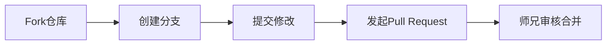

# 🌱 MPPT 学习仓库

> **“我们不是在建造完美的大厦，而是在培育一棵知识树——欢迎来浇水施肥！”**

这是一个关于**最大功率点跟踪（MPPT）技术**的学习仓库，由师兄和师弟共同维护。仓库包含理论学习笔记、算法实现代码和仿真模型，记录了我们在MPPT领域的学习过程。

**特别说明：**

- 🚧 **进行中项目** - 内容会持续更新，目录可能调整
- 🤝 **开放协作** - 欢迎提Issue讨论或提交PR改进
- 📚 **学习导向** - 重点记录思考过程而非完美成果

---

## 📂 仓库全景导览（点击展开目录）

```bash
📦 MPPT
├── 00-awesome-mppt/           # 精选资源合集（建设中）
│   └── awesome-mppt.md
├── 01-光伏发电基础/            # 光伏原理基石
│   ├── 1.1 光伏效应与太阳能电池工作原理.md
│   ├── 1.2 光伏阵列的I-V与P-V特性曲线分析.md
│   └── 1.3 特殊工况分析：局部遮阴及其多峰值现象成因.md
├── 02-最大功率点跟踪 (MPPT)/   # 核心算法解析
│   ├── 2.1 MPPT的必要性与基本原理.md
│   ├── 2.2 传统MPPT算法详解.md
│   └── 2.3 复杂条件下的MPPT算法.md
├── 03-电力电子能量变换/        # 电路实现关键
│   ├── 3.1 DC-DC变换器概述与Buck-Boost电路拓扑.md
│   ├── 3.2 Buck-Boost电路的工作模态与电压增益关系.md
│   └── 3.3 实践挑战：模式平滑过渡技术与输入电压波动抑制策略.md
├── 04-系统级控制策略/          # 扩展应用方向
│   ├── 4.1 并网控制概述.md
│   ├── 4.2 电压控制环与电流控制环（双环控制）设计.md
│   └── 4.3 功率控制系统的架构与策略.md
├── 05-建模与仿真验证/          # 实践验证模块
│   ├── 5.1 仿真工具与应用.md
│   ├── 5.2 控制策略的仿真验证.md
│   └── 5.3 人工智能在MPPT中的应用.md
├── algorithms/                # 算法实战区
│   ├── INC_algorithm.m        # 电导增量法
│   ├── PandO_algorithm.m      # 扰动观察法
│   └── PSO_algorithm.m        # 粒子群算法
├── figures/                   # 图解仓库
│   └── (各类原理图/曲线图)      
├── Q&A/                       # 智慧结晶
│   └── Q&A.md                 # 师兄师弟问答录
├── 代码/                       # 实验性代码（建设中）
│   └── 电导增量法.m
└── simulations/               # 仿真模型（建设中）
    └── (未来存放Simulink模型)  
```

---

## 🔍 当前学习焦点（实时更新）

| 模块                | 状态              | 近期任务                          |
|---------------------|-------------------|----------------------------------|
| **P&O算法优化**     | 🔄 调试自适应步长   | 解决电压震荡问题                  |
| **Buck-Boost仿真**  | 🚧 搭建基础模型     | 实现模式平滑切换                  |
| **局部遮阴应对**     | 📚 文献调研中       | 对比扫描法与智能算法优劣          |
| **Q&A知识库**       | 🌱 持续更新中       | 整理典型问题                      |

---

## 🛠️ 快速使用指南

### 环境配置

1. 安装`MATLAB 2025b`或更高版本
2. 确保已安装`Simulink`和`Simscape Electrical`

### 如果你是学习者

1. 按数字顺序阅读 `01-05` 目录的理论文档
2. 运行 `algorithms/` 中的算法文件理解核心逻辑
3. 查看 `Q&A.md` 解答常见困惑

### 如果你是贡献者

欢迎通过以下方式参与：

- **修正文档**：在理论文档中发现笔误？直接提PR！
- **补充代码**：优化了算法？新增了仿真模型？欢迎提交！
- **回答问题**：能解答 `Q&A.md` 中的开放问题？期待你的见解！

**协作流程：**



---

> 如果对你有启发，请⭐Star支持我们的成长！
